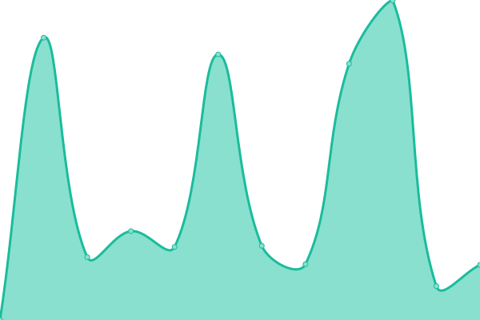
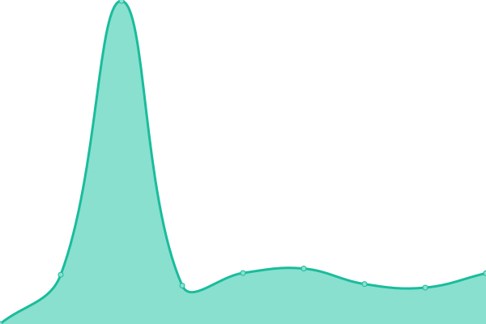

# [📈 Live Status](https://status.asistencia.online): <!--live status--> **🟧 Partial outage**

This repository contains the open-source uptime monitor and status page for [juandavis](https://status.asistencia.online), powered by [Upptime](https://github.com/upptime/upptime).

With [Upptime](https://upptime.js.org), you can get your own unlimited and free uptime monitor and status page, powered entirely by a GitHub repository. We use [Issues](https://github.com/juandavis/status/issues) as incident reports, [Actions](https://github.com/juandavis/status/actions) as uptime monitors, and [Pages](https://status.asistencia.online) for the status page.

<!--start: status pages-->
<!-- This summary is generated by Upptime (https://github.com/upptime/upptime) -->
<!-- Do not edit this manually, your changes will be overwritten -->
<!-- prettier-ignore -->
| URL | Status | History | Response Time | Uptime |
| --- | ------ | ------- | ------------- | ------ |
|  [Asistencia Online Main Website](https://asistencia.online) | 🟩 Up | [asistencia-online-main-website.yml](https://github.com/juandavis/status/commits/HEAD/history/asistencia-online-main-website.yml) | 

 235ms
     
 | 

<a href="https://status.asistencia.online/history/asistencia-online-main-website">100.00%</a>
    

|  [Asistencia Online File Share](https://fs.asistencia.online) | 🟥 Down | [asistencia-online-file-share.yml](https://github.com/juandavis/status/commits/HEAD/history/asistencia-online-file-share.yml) | 

 0ms
     
 | 

<a href="https://status.asistencia.online/history/asistencia-online-file-share">39.33%</a>
    

|  [Nginx Proxy Manager](https://nginx.miredenlinea.com) | 🟩 Up | [nginx-proxy-manager.yml](https://github.com/juandavis/status/commits/HEAD/history/nginx-proxy-manager.yml) | 

 230ms
     
 | 

<a href="https://status.asistencia.online/history/nginx-proxy-manager">100.00%</a>
    

|  [Rport Server](https://r.miredenlinea.com) | 🟥 Down | [rport-server.yml](https://github.com/juandavis/status/commits/HEAD/history/rport-server.yml) | 

 0ms
     
 | 

<a href="https://status.asistencia.online/history/rport-server">65.60%</a>
    

|  [SCC-Power](https://scc-power.com) | 🟩 Up | [scc-power.yml](https://github.com/juandavis/status/commits/HEAD/history/scc-power.yml) | 

 6146ms
     
 | 

<a href="https://status.asistencia.online/history/scc-power">100.00%</a>
    

|  [Macadamia](https://macadamia.ar) | 🟩 Up | [macadamia.yml](https://github.com/juandavis/status/commits/HEAD/history/macadamia.yml) | 

 1391ms
     
 | 

<a href="https://status.asistencia.online/history/macadamia">100.00%</a>
    

|  [Baldolara](https://baldolara.com) | 🟩 Up | [baldolara.yml](https://github.com/juandavis/status/commits/HEAD/history/baldolara.yml) | 

 1596ms
     
 | 

<a href="https://status.asistencia.online/history/baldolara">100.00%</a>
    

<!--end: status pages-->

[**Visit our status website →**](https://status.asistencia.online)

## 📄 License

- Powered by: [Upptime](https://github.com/upptime/upptime)
- Code: [MIT](./LICENSE) © [juandavis](https://status.asistencia.online)
- Data in the `./history` directory: [Open Database License](https://opendatacommons.org/licenses/odbl/1-0/)
