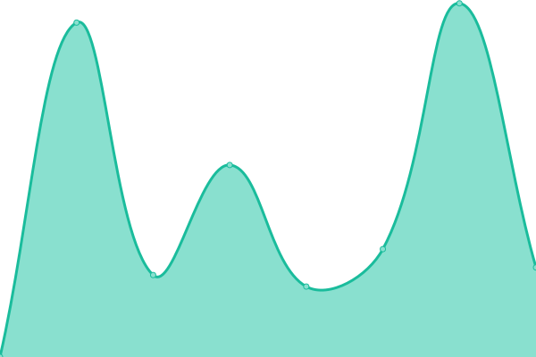
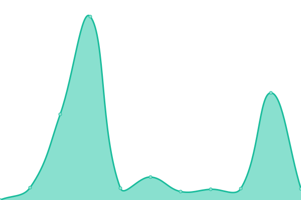

# [📈 Live Status](https://status.asistencia.online): <!--live status--> **🟩 All systems operational**

This repository contains the open-source uptime monitor and status page for [juandavis](https://status.asistencia.online), powered by [Upptime](https://github.com/upptime/upptime).

With [Upptime](https://upptime.js.org), you can get your own unlimited and free uptime monitor and status page, powered entirely by a GitHub repository. We use [Issues](https://github.com/juandavis/status/issues) as incident reports, [Actions](https://github.com/juandavis/status/actions) as uptime monitors, and [Pages](https://status.asistencia.online) for the status page.

<!--start: status pages-->
<!-- This summary is generated by Upptime (https://github.com/upptime/upptime) -->
<!-- Do not edit this manually, your changes will be overwritten -->
<!-- prettier-ignore -->
| URL | Status | History | Response Time | Uptime |
| --- | ------ | ------- | ------------- | ------ |
|  [AO - Main Website](https://asistencia.online) | 🟩 Up | [ao-main-website.yml](https://github.com/juandavis/status/commits/HEAD/history/ao-main-website.yml) | 

 617ms
     
 | 

<a href="https://status.asistencia.online/history/ao-main-website">100.00%</a>
    

|  [AO - File Share](https://fs.asistencia.online) | 🟩 Up | [ao-file-share.yml](https://github.com/juandavis/status/commits/HEAD/history/ao-file-share.yml) | 

 459ms
     
 | 

<a href="https://status.asistencia.online/history/ao-file-share">100.00%</a>
    

|  [AO - PRTG Server](http://prtg.asistencia.online) | 🟩 Up | [ao-prtg-server.yml](https://github.com/juandavis/status/commits/HEAD/history/ao-prtg-server.yml) | 

 415ms
     
 | 

<a href="https://status.asistencia.online/history/ao-prtg-server">100.00%</a>
    

|  [MRL - Nginx Proxy Manager](https://nginx.miredenlinea.com) | 🟩 Up | [mrl-nginx-proxy-manager.yml](https://github.com/juandavis/status/commits/HEAD/history/mrl-nginx-proxy-manager.yml) | 

 167ms
     
 | 

<a href="https://status.asistencia.online/history/mrl-nginx-proxy-manager">100.00%</a>
    

|  [SCC-Power](https://scc-power.com) | 🟩 Up | [scc-power.yml](https://github.com/juandavis/status/commits/HEAD/history/scc-power.yml) | 

 5853ms
     
 | 

<a href="https://status.asistencia.online/history/scc-power">98.21%</a>
    

|  [Macadamia](https://macadamia.ar) | 🟩 Up | [macadamia.yml](https://github.com/juandavis/status/commits/HEAD/history/macadamia.yml) | 

 1215ms
     
 | 

<a href="https://status.asistencia.online/history/macadamia">99.59%</a>
    

|  [Baldolara](https://baldolara.com) | 🟩 Up | [baldolara.yml](https://github.com/juandavis/status/commits/HEAD/history/baldolara.yml) | 

 1372ms
     
 | 

<a href="https://status.asistencia.online/history/baldolara">100.00%</a>
    

|  [Intorvolca](https://intorvolca.com) | 🟩 Up | [intorvolca.yml](https://github.com/juandavis/status/commits/HEAD/history/intorvolca.yml) | 

 1050ms
     
 | 

<a href="https://status.asistencia.online/history/intorvolca">100.00%</a>
    

|  [Smart Global Service](https://smartglobalservicellc.com) | 🟩 Up | [smart-global-service.yml](https://github.com/juandavis/status/commits/HEAD/history/smart-global-service.yml) | 

 1193ms
     
 | 

<a href="https://status.asistencia.online/history/smart-global-service">100.00%</a>
    

|  [Volcanes Prada](https://volcanesprada.net) | 🟩 Up | [volcanes-prada.yml](https://github.com/juandavis/status/commits/HEAD/history/volcanes-prada.yml) | 

 1778ms
     
 | 

<a href="https://status.asistencia.online/history/volcanes-prada">99.87%</a>
    

|  [Corporacion AIT](https://corporacionait.com) | 🟩 Up | [corporacion-ait.yml](https://github.com/juandavis/status/commits/HEAD/history/corporacion-ait.yml) | 

 887ms
     
 | 

<a href="https://status.asistencia.online/history/corporacion-ait">100.00%</a>
    

|  [Uni-Glass](http://uni-glass.com) | 🟩 Up | [uni-glass.yml](https://github.com/juandavis/status/commits/HEAD/history/uni-glass.yml) | 

 587ms
     
 | 

<a href="https://status.asistencia.online/history/uni-glass">100.00%</a>
    

|  [Finnegans](http://teamplace.araucap.com) | 🟩 Up | [finnegans.yml](https://github.com/juandavis/status/commits/HEAD/history/finnegans.yml) | 

 507ms
     
 | 

<a href="https://status.asistencia.online/history/finnegans">98.23%</a>
    

<!--end: status pages-->

[**Visit our status website →**](https://status.asistencia.online)

## 📄 License

- Powered by: [Upptime](https://github.com/upptime/upptime)
- Code: [MIT](./LICENSE) © [juandavis](https://status.asistencia.online)
- Data in the `./history` directory: [Open Database License](https://opendatacommons.org/licenses/odbl/1-0/)
